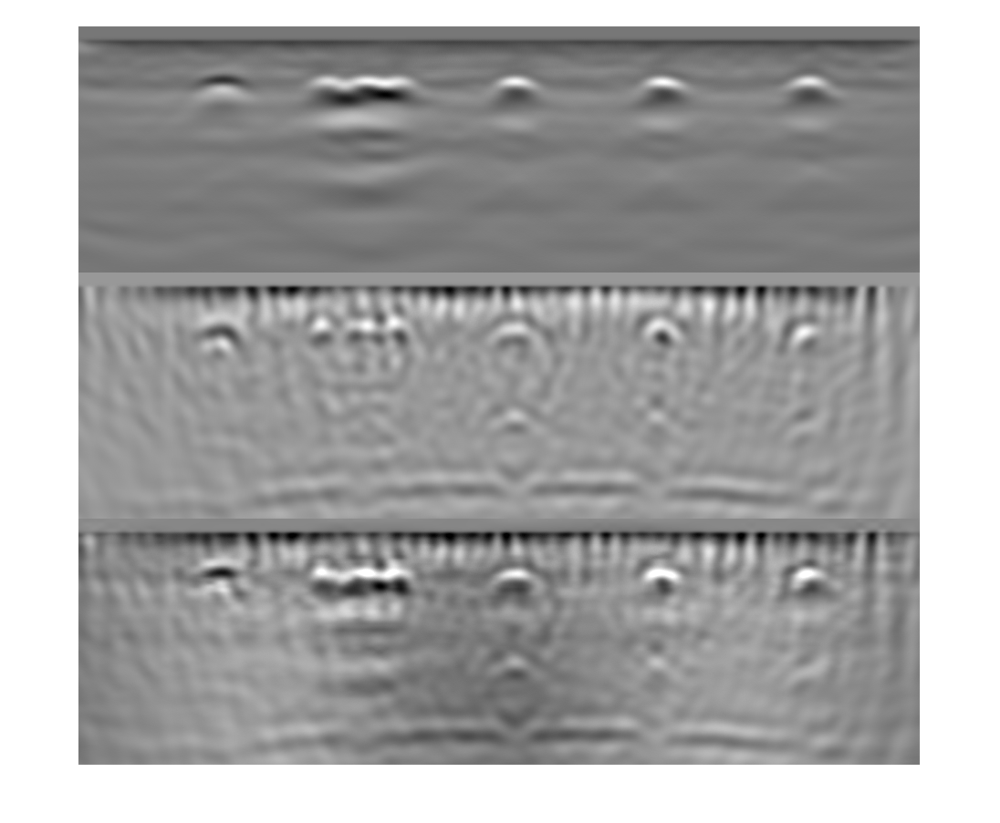

# Image Fusion

## Overview
<p>
The fusion rule used here was informed by the nature of the measurements.
The direct pulse recorded from a reflector follows one of these two patterns,
which consist of a center and two side lobes: dark-bright-dark (i.e., low-high-low intensity),
which we name Type 1 reflector and a bright-dark-bright (i.e., high-low-high intensity),
which we name Type 2 reflector.
Examples of the former and latter are embedded metals such as rebars and air voids or backwalls of the concrete, respectively. 
</p>

```main.m is``` to run the fusion algorithm as well as other fusions described in the paper.

```FusionCustomRule.m``` is the rule used for fusion algorithm.

*Please note that before fusing the XTFM images, you may need to do some preprocessing such as normalization, translation and surface wave removal as described in the paper.*

*Also make sure that you have same size GPR and UEA images from XTFM step.*

<p align="center" >

</p>

## Fusion algorithm

**Step 1**: Each image from the two modalities is decomposed via 2D multilevel wavelet decomposition into a low-frequency, and three high-frequency detail coefficients for , at each level. The decomposition is performed recursively for a desired number of levels, for which we propose it being at least four. The Sym5 wavelet from the Symlets family is used in this study, which is suitable for 2D image processing applications.

**Step 2**: Each approximation is divided into three ranges of bright, dark, and gray based on the intensity of each pixel value. The thresholds to divide these three ranges are: pixel values > mean + one standard deviation, pixel values < mean - one standard deviation, and pixel values within mean +/- one standard deviation, respectively. The following rules are applied, based on the expected capabilities and reliabilities of the two modalities:

- Case 1: If a feature is bright in the images of both modalities, e.g., the center lobe of a Type 1 reflector (e.g., a rebar in concrete), or the side lobes of a Type 2 reflector, we pick the maximum pixel value. 

- Case 2: If a feature is dark in the images of both modalities, e.g., the center lobe of a Type 2 reflector (e.g., the hollow pipe embedded in Specimen 3 or the backwall), or the side lobes of a Type 1 reflector, we select the minimum pixel value. 

- Case 3: If a bright feature is visible in the GPR image, and in the UEA image it is in the gray (i.e., mid-) range, we pick the pixel value from the GPR image.

- Case 4: If a bright feature is visible in the UEA image and the GPR image shows it in the gray range, we select the mean value, since GPR is better suited for detecting bright reflectors (like a rebar). 

- Case 5: If a dark feature is visible in the GPR image and the UEA image shows it in the gray range, we pick the mean value.  

- Case 6: If a dark reflector is visible in the UEA image and the GPR image shows it in the gray range (like the backwall in Specimens 2 and 3), we select the pixel value from the UEA image.

- Case 7: If a feature appears in the gray range in the images of both modalities, we pick the mean pixel value.

- Case 8: If a feature is in the bright range of the GPR image and the dark range of UEA image, we select the pixel value of the bright feature.

- Case 9: If a feature is in the bright range of the UEA image and dark range of the GPR image, we select the mean pixel value. 

**Step 3**: 
Adopt the maximum pixel value of the detail coefficients.

**Step 4**: 
Perform multilevel wavelet reconstruction using the inverse wavelet transform to obtain the final fused image.
