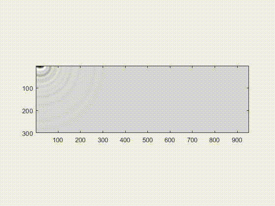
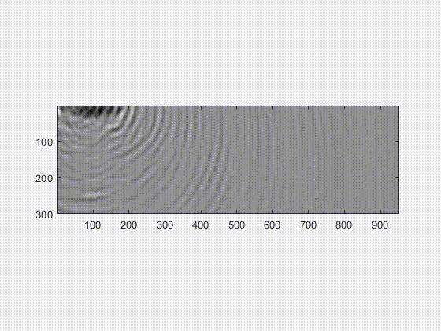
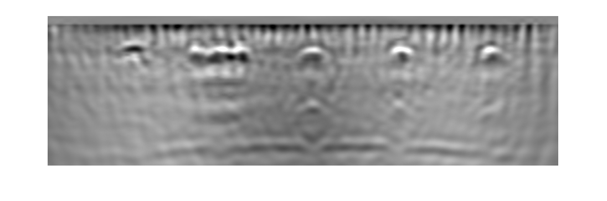

# A Pipeline for Enhanced Multimodal Imaging of Structural Concrete
Code and data for the [paper](https://doi.org/10.1617/s11527-021-01803-w) "A Pipeline for Enhanced Multimodal Imaging of Structural Concrete"

[Link to the article](https://link.springer.com/article/10.1617/s11527-021-01803-w)

[Read the full text](https://link.springer.com/epdf/10.1617/s11527-021-01803-w?sharing_token=XyznorzgkeENGz7OEZpGU3k_ZoEKMXbDGXWx5s5gP1ZPvMzLF_UABix_qIxFxYsINt3Yu5WUiiEJleatrm6USmkCQopu_VNeBXSDCIx1_AvvsCmM0EnL5zDyd6glOSqJSWHYgiZvmaNvhHnwCKdvBn7QmYa1In8AxorlEnsg25E%3D)

*Please check this repo regularly for the newest updates. Click on **watch** (upper right of this page)*

## Overview

### XTFM
XTFM, is an integrated approach based on the total focusing method (TFM) and the synthetic aperture focusing technique (SAFT) that can be used to reconstruct 2D images from ground penetrating radar and ultrasonic echo array (UEA).

For more info, see the [paper](https://link.springer.com/epdf/10.1617/s11527-021-01803-w?sharing_token=XyznorzgkeENGz7OEZpGU3k_ZoEKMXbDGXWx5s5gP1ZPvMzLF_UABix_qIxFxYsINt3Yu5WUiiEJleatrm6USmkCQopu_VNeBXSDCIx1_AvvsCmM0EnL5zDyd6glOSqJSWHYgiZvmaNvhHnwCKdvBn7QmYa1In8AxorlEnsg25E%3D) and the [code](https://github.com/Sinamhd9/A-Pipeline-for-Enhanced-Multimodal-Imaging-of-Structural-Concrete/blob/main/XTFM), or try the tutorial notebooks on GSSI [mini XT GPR](./XTFM/XTFM_GPR.ipynb), or [Proceq Pundit ultrasonic echo array](./XTFM/XTFM_UEA.ipynb). 

<table style="width:100%">
  <tr>
    <th>
      

          
          Ground Penetrating Radar (GPR)
      

    </th>
        <th>

          
           Ultrasonic Echo Array (UEA)
        

    </th>
  </tr>
</table>

### Fusion

A fusion algorithm is developed that uses wavelet decomposition on a series of rules derived from the nature of GPR and UEA XTFM images. Click [here](./Fusion) for codes and more details 

## Usage 
We hope you find these codes useful and you reuse it in your work or improve it.

This repository is meant to be a starting point for researchers and engineers to experiment with our proposed pipeline, reuse it in their work and develop newer/better models.
  
## Citation 

Mehdinia, S., Schumacher, T., Song, X. et al. A pipeline for enhanced multimodal 2D imaging of concrete structures. Mater Struct 54, 228 (2021). https://doi.org/10.1617/s11527-021-01803-w
