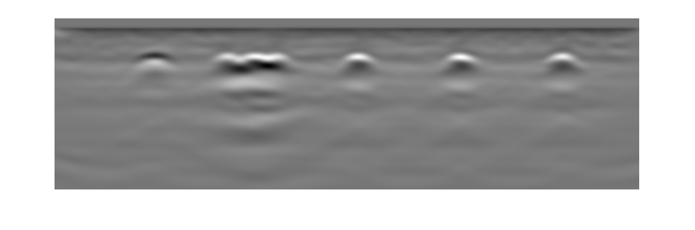

# XTFM

## Overview

XTFM, is an integrated approach based on the total focusing method (TFM) and the
synthetic aperture focusing technique (SAFT) that can be used to reconstruct
2D images from ground penetrating radar and ultrasonic echo array (UEA).

It considers overlapping measurements and works across modalities, i.e., it can process both GPR and UEA
data. Overlapping measurements return an independent array response at different positions where
there is a dependent interelement response at each position. Therefore, a large matrix of
measurements is collected that contains both interelement as well as independent array data. We
treat each UEA measurement the same as one GPR recording where the data are stored in
the form of an nS x sL x nC × nC array where where nS is the number of independent scans,
sL is the signal length of a raw measurement and nC is the number of channels of the instrument. 

For every measurement, the image area that can be covered by the signal length is used for reconstruction. Thus, the beam
is not focused in any particular manner. We deliberately omit the enveloping of the signal (using
the Hilbert Transform) that is often applied in practice since we find that it creates the illusion of
a circular shape for circular objects like rebars. It should be noted that the GPR instrument used in
this study is not an array GPR (it has only one emitter and receiver), however, our proposed XTFM
algorithm works for any number of channels ≥ 2.

## Files

### Python
```XTFM.py``` file is the main XTFM algorithm written in Python.

```XTFM_UEA.ipynb``` is a jupyter notebook example that shows how to perform image reconstruction using XTFM on raw Proceq UEA data file.

```XTFM_GPR.ipynb``` is a jupyter notebook example that shows how to perform image reconstruction using XTFM on mat file of GSSI mini XT data.

*We recommened using Google Colab to go through these Python tutorials.*

### MATLAB
```XTFM.m``` file is the main XTFM algorithm written in MATLAB.

```XTFM_UEA.m``` is a MATLAB example main file that shows how to perform image reconstruction using XTFM on raw Proceq UEA data file.

```XTFM_GPR.m``` is a MATLAB example main file that shows how to perform image reconstruction using XTFM on mat file of GSSI mini XT data.

```readFile.m``` is a function to read raw CSV Proceq file and is required to run the main file (```XTFM_UEA.m```)

```FMC.m``` is a function to turn Proceq data into FMC format and is required to run the main file (```XTFM_UEA.m```)

## Sample Results
These are some sample results for specimen 3 with reasonable parameter choices.
### GPR


### UEA

